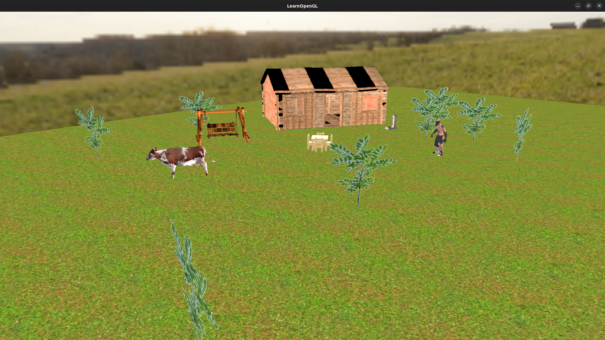

# Serbian Village 
Small Household in a Serbian village with householder, wooden cottage, cow, fountain and swing.
This is my village on Zlatar Mountain - Akmacici.
Inspired by Serbian tradition.

# Gallery

 

# Controls
WASD - Movement

# Implemented
- Required:
    - [x] [1-8 week]
    - [x] [Blending, discard]
    - [x] [Advanced lighting]
    - [x] [Face culling]
- Group A:
    - [x] [Cubemaps - skybox]
